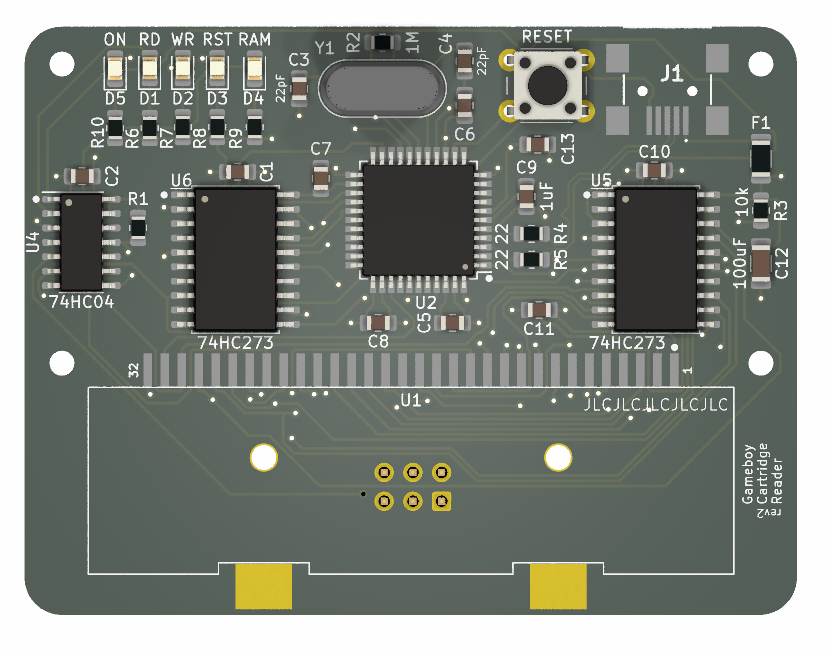

# Gameboy Cartridge Reader

This project is a Gameboy cartridge reader designed around the Atmel ATmega32u4
microcontroller. It provides an easy way to interface with Gameboy cartridges,
enabling data reading, writing, and backup. The design includes a custom PCB,
firmware for the 32u4, and a simple GUI for user interaction.

> [!NOTE]
> Download a Windows 64-bit installer for the GUI [via this link](#)

## Features

* **Custom PCB**: Compact and optimized PCB designed for seamless connection with
  Gameboy cartridges and the 32u4.
* **Firmware**: Lightweight firmware written for the ATmega32u4, handling cartridge
  communication and USB interfacing.
* **GUI**: User-friendly graphical interface to manage cartridge data operations on
  your computer.
* **Open Source**: All design files, firmware, and GUI are open-source and available
  for modification.
* **Writable Cartridge Support**: Includes a PCB design with an SST39SF010 chip, 
  enabling the writing of 32KiB Gameboy games.

> [!IMPORTANT] 
> Please be aware of copyright laws regarding Gameboy and Gameboy
> Color games. Making copies of game data is strictly prohibited in many
> countries unless you own the original cartridge and are creating a backup for
> personal use where such actions are legally permitted. It is your
> responsibility to ensure compliance with local laws. This project is intended
> solely for **educational purposes** and **lawful personal** use.

## GUI

The GUI allows users to interact with their Gameboy cartridges through a
straightforward interface. Users can read ROM data from cartridges, create
backups of save files, and write new save files to supported cartridges.
Additionally, the GUI provides options for verifying data integrity, viewing
cartridge metadata (such as title and game ID), and managing writable cartridges
for flashing custom or homebrew games. Designed for simplicity, the GUI ensures
that all operations are intuitive and accessible, even for beginners.

## PCB

The PCB primarily utilizes SMD components, with the exception of the 16MHz
crystal and the push button, which are through-hole components. To simplify the
soldering process, it is recommended that users order a solder paste stencil and
use a hot plate to solder the SMD components efficiently and accurately.

### Schematic

## Firmware

The firmware for the ATmega32u4 must be compiled using Atmel Studio to ensure
compatibility and proper optimization. Once compiled, the firmware can be
flashed to the microcontroller using an ISP programmer, such as AVRDUDE, for
seamless and reliable programming.

### Fuses

See the `firmware/<DEVICE>/scripts` folder for reading and writing the fuses. 
The proper fuse settings for `lfuse`, `hfuse` and `efuse` should 
be `0xFF`, `0xD8` and `0xCB`, respectively.

## Case

A 3D-printable case for the Gameboy cartridge reader is available in the
[cases](cases) folder, providing a protective and aesthetically pleasing
enclosure for the assembled PCB.