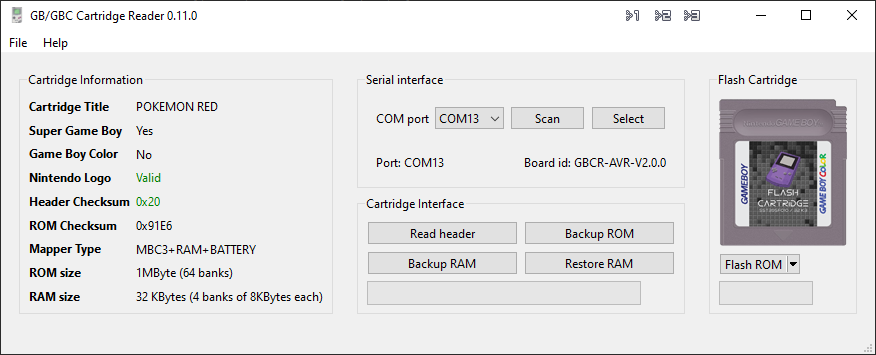

# Gameboy Cartridge Reader

## GUI

## Firmware

### Fuses

See the `firmware/<DEVICE>/scripts` folder for reading and writing the fuses. 
The proper fuse settings for `lfuse`, `hfuse` and `efuse` should 
be `0xFF`, `0xD8` and `0xCB`, respectively.

### Using USBASP for uploading firmware

Download and install `avrdude` from [here](https://github.com/avrdudes/avrdude/releases).

Set the following in Microchip Studio:

Command: `D:\avrdude\avrdude.exe`
Arguments: `-c usbasp -p m32u4 -Uflash:w:"$(ProjectDir)Release\$(TargetName).hex":i`

## PCB

## Case